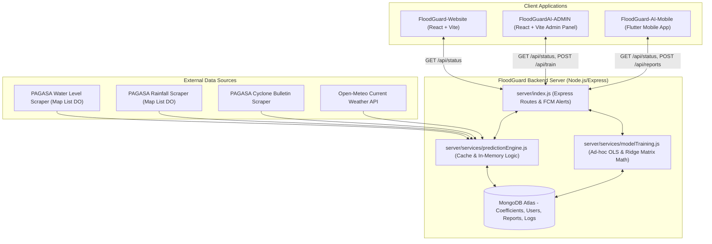
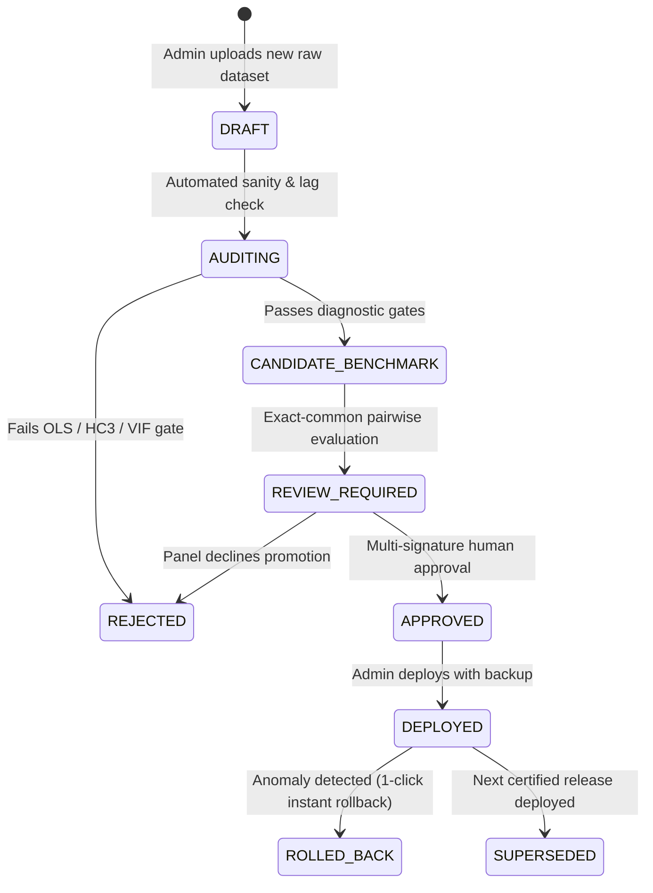
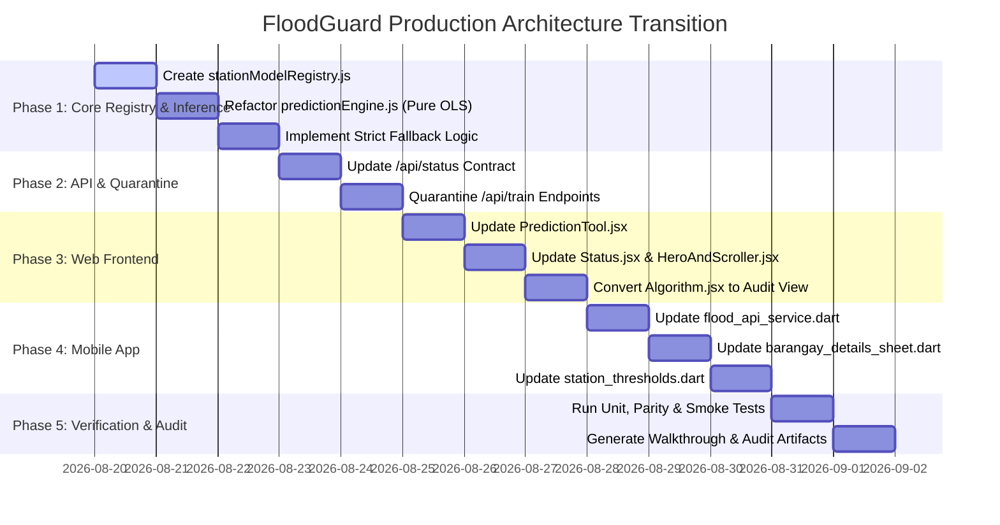

# FloodGuard System Integration & Calibration Technical Architecture Plan

**Document Version**: 1.0.0-PROD-ARCHITECTURE-PLAN  
**Date**: 2026-08-19  
**Target Repository**: `FloodGuard` (Website, Server, Mobile, Admin)  
**Research Authority**: `FLOODGUARD_FINAL_CANONICAL_EVIDENCE_R1_1_DOCUMENTATION_REPAIRED.zip`  
**Research Archive SHA-256**: `f66867e643e5552ad811ccd2add0468c30c6e4bc2e82bdd9450a66286577975b`  
**Execution Mode**: READ-ONLY Planning & Technical Specification (Zero production files modified)

> [!NOTE]
> **Historical Milestone Plan:** This document represents the initial architecture and integration plan. Tumana operational threshold handling was subsequently updated following official DOST-PAGASA FFWS telemetry evidence (Alert: 17.26m, Alarm: 18.26m, Critical: 19.26m, 90/90 regression test suite). See [`07_FINAL_SYSTEM_VERIFICATION/`](file:///C:/Users/chris/Desktop/codes/floodguard/FLOODGUARD_FINAL_DEFENSE_PACKAGE/07_FINAL_SYSTEM_VERIFICATION/) and [`01_RESEARCH_AND_DATA_PROOF/09_OPERATIONAL_PAGASA_THRESHOLD_AND_RAINFALL_EVIDENCE/`](file:///C:/Users/chris/Desktop/codes/floodguard/FLOODGUARD_FINAL_DEFENSE_PACKAGE/01_RESEARCH_AND_DATA_PROOF/09_OPERATIONAL_PAGASA_THRESHOLD_AND_RAINFALL_EVIDENCE/).

---

## 1. Current System Architecture Map

The current FloodGuard codebase is composed of four distinct application components communicating over HTTP/REST and Firebase Cloud Messaging:



---

## 2. Actual Current Prediction Flow (Forensic Audit)

Direct inspection of `server/services/predictionEngine.js`, `server/services/modelTraining.js`, and `server/index.js` reveals the following end-to-end execution flow:

1. **Background Sync Trigger**: `syncAndAutoAlert()` fires every 5 minutes in `server/index.js`.
2. **Telemetry Ingestion**:
   - `fetchMarikina()` scrapes PAGASA water level readings for Sto. Niño, Nangka, Tumana Bridge, Montalban, and Rosario.
   - `fetchUpstreamRainfall()` scrapes 5 rainfall stations (Mt. Campana, Boso-Boso, Mt. Aries, Mt. Oro, Nangka RF) and computes an artificial hydrological weighted total ($0.25 \text{Campana} + 0.25 \text{Boso} + 0.20 \text{Oro} + 0.15 \text{Aries} + 0.15 \text{Nangka}$).
   - `getWeatherContext()` fetches current weather parameters from Open-Meteo.
3. **Model Coefficient Retrieval**:
   - `computePredictions()` queries MongoDB collection `coefficients` for the newest document.
   - If not found or invalid, it falls back to hardcoded `PHASE_A_COEFFICIENTS`:
     $$\widehat{Y} = 3.396904 + 0.718989 Y_{t-1} + 0.005838 R_t + 0.009381 R_{t-1} + 0.001940 \text{Hum} + 0.010036 \text{Temp} + 0.100501 \text{Wind} - 0.016098 \text{HeatIndex}$$
4. **Universal Station Evaluation (Flawed)**:
   - The engine iterates over `['sto_nino', 'nangka', 'tumana', 'montalban', 'rosario']` and executes the exact same generic 8-variable Phase A equation across **all five rivers**, regardless of distinct catchment hydrologic properties.
5. **Synthetic 24-Hour Timeline Generation (Flawed)**:
   - The engine performs linear interpolation across 24 hourly steps between the live sensor reading ($Y_0$) and the single one-step prediction ($Y_1$):
     $$\text{row}[i] = Y_0 + (Y_1 - Y_0) \cdot \left(\frac{i}{24}\right)$$
   - This creates a synthetic 24-hour timeline that gives client apps the false appearance of an hourly predictive model.
6. **Threshold Evaluation & Alert Dispatch**:
   - Compares predicted water level to hardcoded thresholds (`CACHE.thresholds`) and maps all stations to categorical bands (`SAFE`, `ALERT`, `WARNING`, `CRITICAL`).
   - If status changes, `maybeSendAutoWaterLevelAlerts()` dispatches Firebase FCM push notifications to barangay topics.

---

## 3. Exact Files Containing Legacy Model Logic

The following files contain legacy, shared, hardcoded, or uncertified model logic:

1. **`FloodGuard-Website/server/services/predictionEngine.js`**:
   - Lines 37–43: `STATION_MAP` contains legacy uncertified stations `"Montalban"` and `"Rosario"`.
   - Lines 47–53 & 63–68: `CACHE.current_sensors` and `CACHE.thresholds` contain `montalban` (alert: 22.40, alarm: 23.00, critical: 23.60) and `rosario` (alert: 13.00, alarm: 14.00, critical: 15.00).
   - Lines 121–130: `PHASE_A_COEFFICIENTS` hardcodes a single generic model for all rivers.
   - Lines 250–256: Artificial spatial weighting formula across 5 rain gauges.
   - Lines 415–430: `resolveCoefficients()` resolves to a generic 8-variable structure.
   - Lines 432–448: `calculateTimeSeriesPrediction()` applies the same 8-variable formula to every river.
   - Lines 523–538: `computePredictions()` loops over all 5 rivers with identical equation structure.
   - Lines 551–561: Linear interpolation creating artificial 24-hour timeline data.
2. **`FloodGuard-Website/server/index.js`**:
   - Lines 958–965: `RIVER_TO_BARANGAYS` maps barangays to `montalban` and `rosario`.
3. **`FloodGuard-Website/src/AdminComponents/PredictionTool.jsx`**:
   - Lines 98–104: `STATION_THRESHOLDS` includes `montalban`, `rosario`, and assigns alert/alarm/critical thresholds to Tumana.
   - Lines 147–168: Gauge configs for `montalban` and `rosario`.
   - Lines 371–380: Maps over synthetic `prediction.timeline` to display fake 24-hour peak.
4. **`FloodGuard-Website/src/AdminComponents/Status.jsx`**:
   - Lines 18–24: Maps `montalban` and `rosario` status cards.
5. **`FloodGuard-AI-Mobile/lib/utils/station_thresholds.dart`**:
   - Lines 56–61: Defaults for `montalban` and `rosario`, and active alarm thresholds for `tumana`.
6. **`FloodGuard-AI-Mobile/lib/services/flood_api_service.dart`**:
   - Lines 265–327: Maps all barangays to generic `riverData['predicted_water_level']` and status ordinals.
7. **`FloodGuard-AI-Mobile/lib/screens/barangay_details_sheet.dart`**:
   - Lines 451–505: Renders station-threshold alarm gauges for Tumana.
   - Lines 687–786: Renders 24-hour horizontal timeline based on synthetic interpolation.

---

## 4. Exact Files Containing Calibration / Training Logic

The following files contain ad-hoc training, uncertified matrix operations, or direct coefficient overwrite mechanisms:

1. **`FloodGuard-Website/server/services/modelTraining.js`**:
   - Lines 61–105: Custom matrix multiplication and Gauss-Jordan matrix inversion.
   - Line 115: **Ridge Regularization ($\lambda = 10^{-6}$)** injected into normal equations:
     $$\mathbf{X}^T\mathbf{X} + \lambda \mathbf{I}$$
     *(Direct violation of pure Ordinary Least Squares Gauss-Markov specification).*
   - Lines 162–167: **Arbitrary Synthetic Imputation** on missing values:
     - `Rain ?? 0.0`
     - `Temp ?? 28.0`
     - `Humidity ?? 80.0`
     - `Wind ?? 2.0`
     - `HeatIndex ?? temp`
   - Lines 202–209: Arbitrary train/test splitting (`year <= 2020` vs `75% split`).
   - Lines 256–293: `sanitizeCoefficientsForSave()` formats generic 8-variable model for MongoDB.
2. **`FloodGuard-Website/server/index.js`**:
   - Lines 490–523: `POST /api/train` (accepts multipart CSV/XLSX, executes `processAndTrain()`).
   - Lines 525–550: `POST /api/train/save` (writes new `Coefficient` to MongoDB, immediately altering live predictions for all stations).
3. **`FloodGuard-Website/src/AdminComponents/Algorithm.jsx`**:
   - Entire file (Lines 1–533): Admin UI for uploading raw CSVs, previewing training metrics, and pressing "Save to Live Model" to overwrite production coefficients.

---

## 5. Systemic Risks and Conflicts Identified

| Risk Area | Code Location | Observed Violation | Architectural Threat |
|---|---|---|---|
| **Universal Equation Error** | `server/predictionEngine.js` | One single Phase A model applied to Sto. Niño, Nangka, Tumana, Montalban, Rosario | Ignores certified station-specific variables, training partitions, and hydrologic physics. |
| **Ridge Regularization** | `server/modelTraining.js:115` | $\lambda = 10^{-6}$ added to $\mathbf{X}^T\mathbf{X}$ diagonal | Introduces parameter shrinkage bias; violates pure OLS tournament specifications. |
| **Silent Imputation** | `server/modelTraining.js:162` | Missing inputs filled with 0.0, 28.0°C, 80% RH | Violates "Zero Synthetic Imputation" research rule. |
| **Synthetic 24h Timeline** | `server/predictionEngine.js:551` | Linear interpolation between $Y_0$ and $Y_1$ | Misleads users and DRRMO into believing an hourly hydrograph is being forecasted. |
| **Tumana Target Semantics** | `PredictionTool.jsx`, `station_thresholds.dart` | Tumana mapped to Alert/Alarm/Critical alarm triggers | Violates research restriction: Tumana is a daily observation, not an emergency evacuation trigger. |
| **Direct Production Overwrite** | `server/index.js:525`, `Algorithm.jsx` | Un-vetted admin upload immediately updates live predictions | Bypasses HC3 significance testing, VIF screening, persistence verification, and defense records. |
| **Science Garden Telemetry Gap** | `server/predictionEngine.js` | No explicit handling of discontinued 2025 Science Garden rainfall | Will cause Tumana predictions to fail or silently zero out unless true persistence fallback is enforced. |

---

## 6. Proposed Production Model Registry

To enforce complete separation between certified production inference and future calibration research, we propose a canonical, immutable server-side registry module: `FloodGuard-Website/server/config/stationModelRegistry.js`.

### Frozen Production Registry Specification

```javascript
/**
 * FLOODGUARD CANONICAL PRODUCTION MODEL REGISTRY
 * Source Authority: FLOODGUARD_FINAL_CANONICAL_EVIDENCE_R1_1_DOCUMENTATION_REPAIRED.zip
 * SHA-256: f66867e643e5552ad811ccd2add0468c30c6e4bc2e82bdd9450a66286577975b
 * 
 * STRICT RULE: Coefficients are frozen and immutable in production inference.
 */
export const STATION_MODEL_REGISTRY = {
  sto_nino: {
    stationId: 'sto_nino',
    stationName: 'Sto. Niño Water Level Monitoring Station',
    riverBasin: 'Lower Marikina Mainstem',
    candidateId: 'Candidate 9',
    modelVersion: '2.0.0-CERTIFIED',
    sourcePackageChecksum: '4f125ab0c1974cd1bec6c01ce98abb0f1b5d8217e73ca122ba6370967857dd4d',
    targetVariable: 'Sto_Nino_WL_max',
    targetSemantics: 'Daily Maximum Water Level (meters above local datum)',
    targetCadence: 'Daily (24-hour operational lookahead)',
    predictors: ['Sto_t_1', 'Sto_t_3', 'BosoBoso_t_1'],
    requiredLags: { waterLevel: [1, 3], rainfall: [1] },
    dependencyGauges: {
      inSituWaterLevel: 'Sto. Niño WL',
      rainfall: 'Mt. Boso-Boso (MMDA Telemetry)'
    },
    coefficients: {
      intercept: 3.5458516106,
      Sto_t_1: 0.4641997604,
      Sto_t_3: 0.2456934414,
      BosoBoso_t_1: 0.0115250490
    },
    diagnostics: {
      trainingN: 1969,
      refitN: 2441,
      refitR2: 0.8988,
      validationMAE: 0.316347,
      validationRMSE: 0.591145,
      maxVIF: 2.0610,
      hc3SlopePValues: '< 0.0001 (All Slopes Significant)'
    },
    operationalAvailability: {
      historicalCoverage: '90.60% (617 / 681 days in 2024-2025)',
      missingSensorFallback: 'TRUE_PERSISTENCE (if rainfall missing), NULL (if in-situ WL missing)'
    },
    intradayPeakForecast: false,
    thresholdMappingAllowed: true,
    thresholds: { alert: 15.00, alarm: 16.00, critical: 17.00 },
    limitations: 'Dynamic surge model. May underestimate extreme rapid flash peaks during typhoon landfalls (e.g. Typhoon Crising 2025). Live sirens must remain sensor-triggered.'
  },

  nangka: {
    stationId: 'nangka',
    stationName: 'Nangka River Monitoring Station',
    riverBasin: 'Nangka Tributary',
    candidateId: 'Candidate 4',
    modelVersion: '2.0.0-CERTIFIED',
    sourcePackageChecksum: 'd787621ae87e2f1c149806f3a48ef7dca542753c3ba1e89160a3fd7a2d9648f8',
    targetVariable: 'Nangka_WL_max',
    targetSemantics: 'Daily Maximum Water Level (meters above local datum)',
    targetCadence: 'Daily (24-hour operational lookahead)',
    predictors: ['Nangka_WL_t_1', 'BosoBoso_t_1'],
    requiredLags: { waterLevel: [1], rainfall: [1] },
    dependencyGauges: {
      inSituWaterLevel: 'Nangka WL',
      rainfall: 'Mt. Boso-Boso (MMDA Telemetry)'
    },
    coefficients: {
      intercept: 8.1148167138,
      Nangka_WL_t_1: 0.4897688121,
      BosoBoso_t_1: 0.0097374948
    },
    diagnostics: {
      trainingN: 1810,
      refitN: 2128,
      refitR2: 0.4335,
      validationMAE: 0.143768,
      validationRMSE: 0.384644,
      maxVIF: 1.5957,
      hc3SlopePValues: '< 0.0001 (All Slopes Significant)',
      tournamentStanding: 'Rank 1 Overall Winner (14 of 14 exact-common-date pairwise MAE wins)'
    },
    operationalAvailability: {
      historicalCoverage: '83.49% primary (354 / 424 days); 83.96% with persistence fallback',
      missingSensorFallback: 'TRUE_PERSISTENCE (if rainfall missing), NULL (if in-situ WL missing)'
    },
    intradayPeakForecast: false,
    thresholdMappingAllowed: true,
    thresholds: { alert: 16.50, alarm: 17.10, critical: 17.70 },
    limitations: 'Tributary catchment exhibits fast flash response. Single rainfall gauge captures general watershed volume; localized high-elevation cloudbursts may lag.'
  },

  tumana: {
    stationId: 'tumana',
    stationName: 'Tumana Bridge Monitoring Station',
    riverBasin: 'Middle Marikina Mainstem',
    candidateId: 'Candidate 8',
    modelVersion: '2.0.0-CERTIFIED',
    sourcePackageChecksum: 'b84441b13dcbd3afaa7140728f44bbcac3d9db3a71882d15864ff1e9885e38cb',
    targetVariable: 'Tumana_WL',
    targetSemantics: 'PAGASA-reported daily Tumana water-level observation',
    targetCadence: 'Daily (Single Observation Reference)',
    predictors: ['Tumana_WL_t_1', 'PAGASA_SG_Rain_t_1'],
    requiredLags: { waterLevel: [1], rainfall: [1] },
    dependencyGauges: {
      inSituWaterLevel: 'Tumana HMDAS',
      rainfall: 'PAGASA Science Garden Synoptic Station'
    },
    coefficients: {
      intercept: 1.5147240225,
      Tumana_WL_t_1: 0.8735442115,
      PAGASA_SG_Rain_t_1: 0.0084816301
    },
    diagnostics: {
      trainingN: 1068,
      refitN: 1648,
      refitR2: 0.8426,
      validationMAE: 0.148147,
      validationRMSE: 0.324368,
      maxVIF: 1.1212,
      hc3SlopePValues: 'p < 0.05 (All Slopes Significant)',
      tournamentStanding: 'Eligible MLR MAE Winner (10 of 14 pairwise MAE wins)'
    },
    operationalAvailability: {
      historicalCoverage: '54.95% primary; 96.64% total operational availability with persistence fallback',
      missingSensorFallback: 'TRUE_PERSISTENCE (active for 2025 Science Garden data gap)'
    },
    intradayPeakForecast: false,
    thresholdMappingAllowed: false, // STRICTLY PROHIBITED FOR TUMANA
    thresholds: null,
    limitations: 'Daily observation cadence only. Metadata does not confirm whether daily reading represents maximum, mean, or fixed-hour stage. Strictly for daily decision support; NEVER use for hourly peak, flood depth, or automated emergency alarm triggers.'
  }
};
```

---

## 7. Proposed Server / API Contract

We replace the unstructured, interpolated `/api/status` endpoint with a deterministic, typed API schema. Calculations occur **exclusively on the server**; client devices perform zero mathematical inference.

### Unified Endpoint: `GET /api/status` (or `GET /api/v2/forecasts`)

```json
{
  "systemStatus": "OPERATIONAL",
  "generatedAt": "2026-08-19T15:30:00.000Z",
  "forecastHorizon": "24_HOURS_AHEAD_DAILY",
  "dataFreshness": {
    "latestWaterLevelIngest": "2026-08-19T15:00:00.000Z",
    "latestRainfallIngest": "2026-08-19T15:00:00.000Z",
    "ingestLatencySeconds": 180
  },
  "storm": {
    "active": false,
    "name": "None",
    "category": "No Active Tropical Cyclone",
    "signal": 0
  },
  "stations": {
    "sto_nino": {
      "stationId": "sto_nino",
      "stationName": "Sto. Niño Water Level Monitoring Station",
      "candidateId": "Candidate 9",
      "modelVersion": "2.0.0-CERTIFIED",
      "sourcePackageChecksum": "4f125ab0c1974cd1bec6c01ce98abb0f1b5d8217e73ca122ba6370967857dd4d",
      "targetSemantics": "Daily Maximum Water Level (meters above local datum)",
      "targetDate": "2026-08-20",
      "observedStage": 13.45,
      "observedAt": "2026-08-19T15:00:00.000Z",
      "forecastStage": 14.12,
      "calculationMode": "primary_model",
      "inputsUsed": {
        "Sto_t_1": 13.45,
        "Sto_t_3": 13.10,
        "BosoBoso_t_1": 18.5
      },
      "missingInputs": [],
      "statusBand": "SAFE",
      "thresholdMappingAllowed": true,
      "thresholds": { "alert": 15.00, "alarm": 16.00, "critical": 17.00 },
      "intradayPeakForecast": false,
      "limitations": "Dynamic surge model. Live sirens must remain sensor-triggered."
    },
    "nangka": {
      "stationId": "nangka",
      "stationName": "Nangka River Monitoring Station",
      "candidateId": "Candidate 4",
      "modelVersion": "2.0.0-CERTIFIED",
      "sourcePackageChecksum": "d787621ae87e2f1c149806f3a48ef7dca542753c3ba1e89160a3fd7a2d9648f8",
      "targetSemantics": "Daily Maximum Water Level (meters above local datum)",
      "targetDate": "2026-08-20",
      "observedStage": 15.82,
      "observedAt": "2026-08-19T15:00:00.000Z",
      "forecastStage": 16.04,
      "calculationMode": "primary_model",
      "inputsUsed": {
        "Nangka_WL_t_1": 15.82,
        "BosoBoso_t_1": 18.5
      },
      "missingInputs": [],
      "statusBand": "SAFE",
      "thresholdMappingAllowed": true,
      "thresholds": { "alert": 16.50, "alarm": 17.10, "critical": 17.70 },
      "intradayPeakForecast": false,
      "limitations": "Tributary catchment exhibits fast flash response."
    },
    "tumana": {
      "stationId": "tumana",
      "stationName": "Tumana Bridge Monitoring Station",
      "candidateId": "Candidate 8",
      "modelVersion": "2.0.0-CERTIFIED",
      "sourcePackageChecksum": "b84441b13dcbd3afaa7140728f44bbcac3d9db3a71882d15864ff1e9885e38cb",
      "targetSemantics": "PAGASA-reported daily Tumana water-level observation",
      "targetDate": "2026-08-20",
      "observedStage": 12.30,
      "observedAt": "2026-08-19T15:00:00.000Z",
      "forecastStage": 12.30,
      "calculationMode": "persistence_fallback",
      "inputsUsed": {
        "Tumana_WL_t_1": 12.30
      },
      "missingInputs": ["PAGASA_SG_Rain_t_1"],
      "statusBand": "UNMAPPED_DAILY_OBSERVATION",
      "thresholdMappingAllowed": false,
      "thresholds": null,
      "intradayPeakForecast": false,
      "limitations": "PAGASA Science Garden rainfall unavailable; running on verified persistence fallback. Strictly daily decision support; not an official emergency alarm trigger."
    }
  }
}
```

---

## 8. Proposed Web Frontend Modifications

### A. Component-Level Changes
1. **`HeroAndScroller.jsx`**:
   - Remove pseudo-probability percentages (e.g. `70% - 100% High Risk`). Replace with standard categorical text: `SAFE`, `ALERT`, `WARNING`, `CRITICAL`.
   - Update phone mockup to display genuine station cards without simulated multi-hour oscillations.
2. **`PredictionTool.jsx`**:
   - Remove Montalban and Rosario from river selection buttons.
   - For Sto. Niño and Nangka: Render clean daily forecast card displaying Observed WL, Forecast WL, Calculation Mode badge (`PRIMARY OLS` vs `PERSISTENCE FALLBACK`), and Station Threshold gauge.
   - For Tumana: Remove the Alert/Alarm/Critical gauge entirely. Render a dedicated "Daily Water-Level Observation Reference" card showing:
     - Observed Stage ($Y_t$)
     - Forecasted Next-Day Observation ($\widehat{Y}_{t+1}$)
     - Mode badge (e.g., `PERSISTENCE FALLBACK (Science Garden Offline)`)
     - Prominent callout box: *"PAGASA daily observation target. Not an evacuation or flash-peak trigger."*
   - Remove the fake 24-hour horizontal scrolling timeline graph.
3. **`Status.jsx` & `Overview.jsx`**:
   - Display only the 3 canonical stations (Sto. Niño, Nangka, Tumana).
   - Display model version, candidate ID, target semantics, and calculation mode per station.
4. **`Algorithm.jsx`**:
   - Convert from an active production overwrite tool into an **Offline Calibration Research Audit Viewer** (see Section 10). Disable the `Save to Live Model` button.

---

## 9. Proposed Mobile App Modifications (Flutter)

### A. Data Layer (`lib/services/flood_api_service.dart`)
- Update `FloodData` model to match the new API contract:
  - Add `String calculationMode` (`primary_model`, `persistence_fallback`, `unavailable`).
  - Add `String candidateId`, `String modelVersion`, `String targetSemantics`.
  - Add `bool thresholdMappingAllowed`.
  - Deprecate `peakPredictedLevel` and synthetic 24-hour timeline parsing.
- Update `barangayToSensor` mapping: Map all 16 Marikina barangays strictly to `sto_nino`, `nangka`, or `tumana`.

### B. UI Layer (`lib/screens/barangay_details_sheet.dart`)
- **Observed vs. Forecast Distinction**:
  - Show two distinct metric blocks: `CURRENT OBSERVED LEVEL` and `24H AHEAD FORECAST TARGET`.
- **Mode Badge**: Display visual tag indicating whether the primary MLR model or persistence fallback generated the forecast.
- **Tumana Safety Guard**:
  - When `thresholdMappingAllowed == false` (Tumana), do **not** render the colored gauge bar or `CRITICAL/WARNING/ALERT` labels.
  - Display informative daily decision-support banner:  
    `"Target: PAGASA-reported daily Tumana water-level observation. For evacuation triggers, refer to Sto. Niño and Nangka sirens and official MDRRMO advisories."`
- **Timeline Replacement**:
  - Replace the 24-hour horizontal scrolling list with a clean **24-Hour Hydrologic Forecast Summary** card showing previous observed lag ($t-1$), today's reading ($t$), and tomorrow's forecast ($t+1$).

---

## 10. Calibration Governance & Research Workflow Design

To ensure that future retraining or recalibration never corrupts production stability, we establish a 15-point governance framework:



### 15-Point Calibration Governance Rules

1. **Quarantined Storage**: Calibration runs are stored in a dedicated `model_calibrations` database collection; they can **never** overwrite active production registry memory directly.
2. **Immutable Source Snapshot**: Every calibration run hashes and archives its raw input CSV/XLSX with SHA-256.
3. **Calendar Lag Integrity**: Lag generation enforces strict calendar continuity ($t-1, t-3$); missing rows produce explicit `NaN` records, never synthetic interpolations.
4. **Pure OLS Only**: Regression strictly follows Ordinary Least Squares Gauss-Markov algebra ($\mathbf{b} = (\mathbf{X}^T\mathbf{X})^{-1}\mathbf{X}^T\mathbf{y}$). Ridge shrinkage ($\lambda$) and Lasso regularization are prohibited.
5. **Station-Locked Candidates**: Retraining evaluates the exact 15 frozen candidate feature sets per station; arbitrary feature combinations are prohibited.
6. **Strict Chronological Split**: Data is partitioned chronologically into Training, Validation, and Retrospective partitions. Random k-fold cross-validation is forbidden on time-series.
7. **Econometric Diagnostic Gates**:
   - Maximum VIF must be $\le 5.0$ (screening for multicollinearity).
   - Heteroskedasticity-consistent HC3 standard errors must show $p < 0.05$ on all predictor slopes.
8. **Persistence Benchmark Mandate**: Every candidate must be benchmarked against True Persistence ($\widehat{Y}_t = Y_{t-1}$) on exact-common dates.
9. **Exact-Common Pairwise Tournament**: Challenger models must be ranked via pairwise head-to-head comparison on exact-common validation dates.
10. **Parity Proof Verification**: Parameter estimates must match bit-for-bit across Python, JavaScript, and Excel formula proof engines.
11. **Multi-Stage Approval State Machine**: Transitions require: `DRAFT` $\to$ `AUDITED` $\to$ `APPROVED` $\to$ `DEPLOYED`.
12. **Immutable Audit Trail**: All calibration attempts, diagnostics, reviewer IDs, and timestamps are logged to `calibration_audit_log`.
13. **Instant 1-Click Rollback**: The deployment engine maintains the previous certified model version in hot standby, allowing instantaneous 0-downtime rollback.
14. **Zero Automated Deployment**: Retraining algorithms cannot auto-deploy; every deployment requires an explicit, authenticated admin action.
15. **Zero Lookahead Bias**: No future data ($t+1$) or live outcome may be used to tune or optimize current-day parameters.

### Endpoint Recommendation for `POST /api/train` and `POST /api/train/save`
- **Recommendation**: **DISABLE AND QUARANTINE**.
- **Rationale**: The current `/api/train` endpoint applies Ridge regularization, uses arbitrary missing-value fill, and allows un-vetted admin uploads to immediately overwrite the single universal production model in MongoDB. It must be locked behind an administrative feature flag, converted to an audit-only calibration sandbox, and disconnected from the production prediction loop.

---

## 11. Phased Implementation Plan



---

## 12. File-by-File Change Matrix

| File Path | Component | Action | Description of Required Change | Risk Rating |
|---|---|---|---|:---:|
| `FloodGuard-Website/server/config/stationModelRegistry.js` | Server | **NEW** | Authoritative frozen station model registry with certified equations, checksums, VIFs, and fallbacks. | Low |
| `FloodGuard-Website/server/services/predictionEngine.js` | Server | **MODIFY** | Replace generic model and fake 24h interpolation with station-specific pure OLS evaluation and strict fallback rules. | High |
| `FloodGuard-Website/server/services/modelTraining.js` | Server | **MODIFY** | Remove Ridge regularizer; convert to offline research module; enforce pure OLS and lag validation. | Med |
| `FloodGuard-Website/server/index.js` | Server | **MODIFY** | Update `/api/status` schema; quarantine `/api/train/save` from production overwrite; remove Montalban/Rosario. | Med |
| `FloodGuard-Website/src/AdminComponents/PredictionTool.jsx` | Web Admin | **MODIFY** | Consume station registry; remove 24h timeline graph; render Tumana as unmapped daily observation. | Med |
| `FloodGuard-Website/src/AdminComponents/Status.jsx` | Web Admin | **MODIFY** | Display 3 canonical stations with candidate metadata and fallback status. | Low |
| `FloodGuard-Website/src/AdminComponents/Algorithm.jsx` | Web Admin | **MODIFY** | Convert to read-only Calibration Audit Viewer; disable direct live saving. | Low |
| `FloodGuard-Website/src/components/HeroAndScroller.jsx` | Web Client | **MODIFY** | Clean up categorical status descriptions; align mockup with certified stations. | Low |
| `FloodGuard-AI-Mobile/lib/config/api_config.dart` | Mobile | **MODIFY** | Verify backend API route definitions. | Low |
| `FloodGuard-AI-Mobile/lib/services/flood_api_service.dart` | Mobile | **MODIFY** | Update `FloodData` model for calculation mode, target semantics, and threshold flags. | Med |
| `FloodGuard-AI-Mobile/lib/utils/station_thresholds.dart` | Mobile | **MODIFY** | Remove Montalban/Rosario; disallow threshold status mapping for Tumana. | Med |
| `FloodGuard-AI-Mobile/lib/screens/barangay_details_sheet.dart` | Mobile | **MODIFY** | Render observed vs forecast distinction, mode badges, and Tumana advisory banner; remove 24h timeline. | Med |

---

## 13. Complete Test Matrix

### A. Mathematical Parity & Calculation Tests
1. **Sto. Niño C9 Verification**:
   - Given $\text{Sto}_{t-1} = 13.50$, $\text{Sto}_{t-3} = 13.00$, $\text{BosoBoso}_{t-1} = 25.0$:
   - Verify $\widehat{Y} = 3.545852 + 0.464200(13.50) + 0.245693(13.00) + 0.011525(25.0) = \mathbf{13.2946\text{ m}}$.
2. **Nangka C4 Verification**:
   - Given $\text{Nangka}_{t-1} = 16.00$, $\text{BosoBoso}_{t-1} = 30.0$:
   - Verify $\widehat{Y} = 8.114817 + 0.489769(16.00) + 0.009737(30.0) = \mathbf{16.2432\text{ m}}$.
3. **Tumana C8 Verification**:
   - Given $\text{Tumana}_{t-1} = 12.50$, $\text{PAGASA\_SG\_Rain}_{t-1} = 15.0$:
   - Verify $\widehat{Y} = 1.514724 + 0.873544(12.50) + 0.008482(15.0) = \mathbf{12.5613\text{ m}}$.

### B. Runtime Fallback Tests
1. **Rainfall Failure**: Missing Boso-Boso rainfall with valid $\text{Sto}_{t-1} = 14.20\text{ m} \implies$ Returns `mode: "persistence_fallback"`, `forecastStage: 14.20`.
2. **In-situ Level Missing**: Missing $\text{Sto}_{t-1} \implies$ Returns `mode: "unavailable"`, `forecastStage: null`.
3. **Tumana 2025 Science Garden Discontinuation**: Valid $\text{Tumana}_{t-1} = 12.10\text{ m}$, missing Science Garden rain $\implies$ Returns `mode: "persistence_fallback"`, `forecastStage: 12.10`.
4. **Sto. Niño Lag 3 Missing**: Valid $\text{Sto}_{t-1}$, missing $\text{Sto}_{t-3} \implies$ Returns `mode: "unavailable"`, `forecastStage: null`.

### C. Security & Integration Smoke Tests
1. Execute `server/scripts/securitySmokeTest.mjs` to verify authenticated routes, admin barriers, and public endpoint safety.
2. Flutter widget tests verifying that Tumana does not render colored alert badges or emergency warning text.

---

## 14. Rollback Plan

If unexpected anomalies occur post-implementation:

1. **Server Rollback**:
   - The original pre-repair server files will be preserved in a local git stash / branch.
   - If server startup fails, restore `server/index.js` and `server/services/predictionEngine.js` from backup commit.
2. **Database Rollback**:
   - No schema migrations or data drops are performed. MongoDB `coefficients` collection remains untouched.
3. **Client Rollback**:
   - Web frontend and Flutter app can instantly toggle between API versions via `config/api.js` and `api_config.dart`.

---

## 15. Items That Must Remain Untouched

The following files and directories are **immutable research records** and must NEVER be modified, deleted, or overwritten during implementation:

1. `FLOODGUARD_FINAL_CANONICAL_EVIDENCE_R1_1_DOCUMENTATION_REPAIRED/` and its ZIP archive (`FLOODGUARD_FINAL_CANONICAL_EVIDENCE_R1_1_DOCUMENTATION_REPAIRED.zip`).
2. `FLOODGUARD_FINAL_CANONICAL_EVIDENCE_R1_1_DOCUMENTATION_REPAIRED_CHECKSUM.txt`.
3. `FLOODGUARD_FINAL_CANONICAL_EVIDENCE_R1_1_VERIFICATION_AUDIT.md`.
4. All canonical station packages:
   - `FLOODGUARD_STO_NINO_CANDIDATE9_FINAL_DEFENSE_CERTIFIED_R2.zip`
   - `FLOODGUARD_NANGKA_PHASE0_AUDIT_R3_CERTIFIED.zip`
   - `FLOODGUARD_NANGKA_MODEL_TOURNAMENT_R5_RECONCILED.zip`
   - `FLOODGUARD_TUMANA_DAILY_MODEL_R3_1_2_FINAL_EVIDENCE_RECONCILED.zip`
5. All underlying historical hourly masters (`*hourly_master_2016_2025.csv`).
6. All defense spreadsheets (`*.xlsx`) and defense records (`*.pdf`).

---

## 16. Do Not Let Implementation Change These Research Facts

During technical integration, the implementation must strictly respect and preserve the following empirical research truths:

1. **Sto. Niño Candidate 9**:
   - Equation: $\widehat{\text{Sto\_WL}}_t = 3.5458516106 + 0.4641997604 \cdot \text{Sto}_{t-1} + 0.2456934414 \cdot \text{Sto}_{t-3} + 0.0115250490 \cdot \text{BosoBoso}_{t-1}$
   - Max VIF: **2.0610**
   - Rainfall Source: Mt. Boso-Boso telemetry. Never say it uses Mt. Oro rainfall.
   - Selection Rationale: Candidate 9 was retained under the certified operational decision framework, with valid diagnostics, a practical dependency set, stated availability, and disclosed trade-offs.
2. **Nangka Candidate 4**:
   - Equation: $\widehat{\text{Nangka\_WL}}_t = 8.1148167138 + 0.4897688121 \cdot \text{Nangka}_{t-1} + 0.0097374948 \cdot \text{BosoBoso}_{t-1}$
   - Max VIF: **1.5957**
   - Validation MAE: 0.143768 m | Validation RMSE: 0.384644 m | Candidate 5 RMSE: 0.380929 m.
   - Truthful Phrasing: Candidate 4 achieved Rank 1 in the frozen 15-candidate validation tournament with 14 of 14 exact-common-date pairwise MAE wins and the lowest validation MAE (0.1438 m). Candidate 5 had a slightly lower candidate-specific validation RMSE (0.3809 m versus 0.3846 m), which is disclosed as a trade-off.
   - Never claim Candidate 4 has lowest RMSE or best RMSE.
3. **Tumana Candidate 8**:
   - Equation: $\widehat{\text{Tumana\_WL}}_t = 1.5147240225 + 0.8735442115 \cdot \text{Tumana}_{t-1} + 0.0084816301 \cdot \text{PAGASA\_SG\_Rain}_{t-1}$
   - Max VIF: **1.1212**
   - Target Semantics: Strictly "PAGASA-reported daily Tumana water-level observation".
   - Never describe Tumana as daily maximum, daily mean, fixed-time reading, hourly stage, intraday peak, flood depth, flood probability, or automated emergency trigger.
4. **Econometric Standards**:
   - Pure OLS only ($K \ge 2$, with in-situ water level lag).
   - Zero synthetic imputation on missing values.
   - True Persistence ($\widehat{Y}_t = Y_{t-1}$) as graceful fallback when remote rainfall telemetry is missing.

---

## 17. Questions or Blockers Requiring Review

1. **Review of Admin Algorithm Component**:
   - Does the review team approve converting `Algorithm.jsx` into a read-only historical calibration audit viewer, fully severing the direct "Save to Live Model" button from production MongoDB? *(Recommended: YES).*
2. **Review of Legacy Stations (Montalban / Rosario)**:
   - Does the review team approve removing Montalban and Rosario from live automated alert topics and marking them as unmonitored legacy sensors in the UI? *(Recommended: YES, as they lack certified OLS tournament models).*
3. **Review of Mobile Timeline Replacement**:
   - Does the review team approve replacing the synthetic 24-hour interpolated timeline list with the honest 3-point Lag/Current/Forecast card in the Flutter mobile bottom sheet? *(Recommended: YES, to eliminate deceptive precision).*

---

# Verification & Completion Seal

FLOODGUARD_SYSTEM_INTEGRATION_AND_CALIBRATION_PLAN_READY
