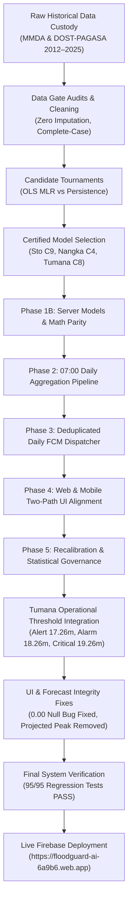

# FLOODGUARD MASTER PROOF CHAIN

This document traces the complete evidentiary chain from raw source data custody to operational system verification and live Firebase deployment.

## Proof Chain Milestones

1. **Raw Custody Proof:** `01_RESEARCH_AND_DATA_PROOF/01_SOURCE_AND_PROVENANCE/`
2. **Data Gate Proof:** `01_RESEARCH_AND_DATA_PROOF/02_DATA_AUDITS_AND_DATA_GATE/`
3. **Model Selection Proof:** `01_RESEARCH_AND_DATA_PROOF/04_CANDIDATE_MODEL_TOURNAMENTS/` & `06_FINAL_MODEL_SELECTION_PROOF/`
4. **PAGASA Operational Evidence:** `01_RESEARCH_AND_DATA_PROOF/09_OPERATIONAL_PAGASA_THRESHOLD_AND_RAINFALL_EVIDENCE/`
5. **Phase 1B–5 Implementation Proofs:** `02_PHASE_1B_SERVER_MODELS/` to `06_PHASE_5_CALIBRATION_GOVERNANCE/`
6. **Final System Verification (95/95 Tests):** `07_FINAL_SYSTEM_VERIFICATION/`
7. **Live Production Deployment:** `07_FINAL_SYSTEM_VERIFICATION/FLOODGUARD_FINAL_DEPLOYMENT_REPORT.md`
